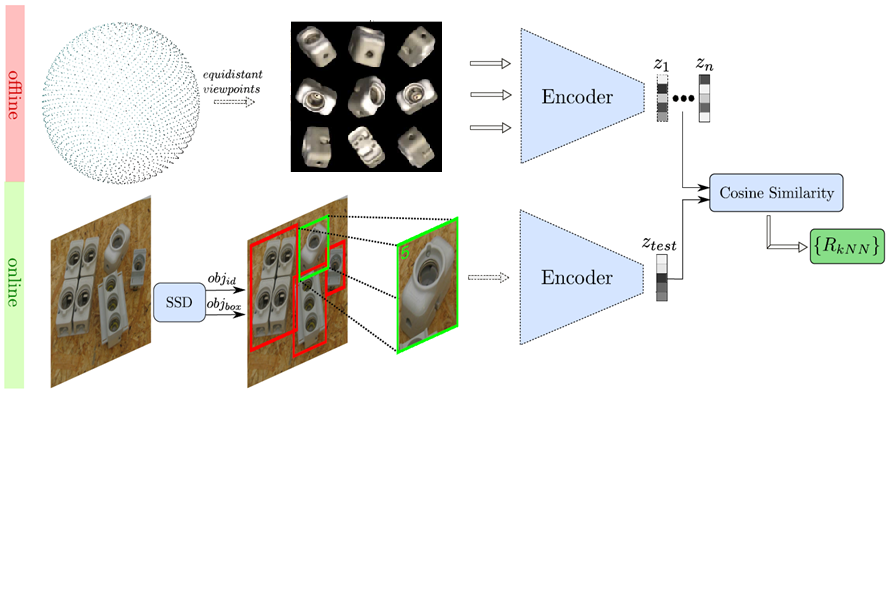

# Introduction
In this project, a deep-learning-
based object pose estimation approach [1] is implemented to estimate the 3D orientation of the target object in single rgb images.  

<p align="center">
    
    <br>
    <sup>System architecture</sup>
</p>

The main idea of this approach is to implicitly learn representations from rendered
3d model views with autoencoder, and then determine the orientation of the object
employing the nearest neighbor search. On one hand, since it avoids one-to-many
mappings from images to orientations, it is able to handle ambiguous poses caused
by symmetric views. In another hand, it can be trained on synthetic object views in
a self-supervised way and hence removes the need for a large pose-annotated dataset.
Besides, by applying random augmentations on the training dataset, it is able to
yield a robust estimation against occlusion and cluttered backgrounds.
# Prerequisites
python 3.6  
cuda 10.1  
pytorch 1.4  
pyrender  

# Usage
### 1. Create synthetic dataset with 
```
$ python offRenderer.py [OPTIONS] OBJ MODE [RADIUS] [LIGHT] [NUM_SAMPLE]
``` 

* OBJ : string  
The object 3d mesh that is to be sampled from.

* MODE : train, test  
Set MODE to `train` will sample points regularly on the sphere, while set MODE to `test` will sample points randomly.

* [RADIUS] : float, default = 1.5  
The radius of the sphere

* [LIGHT] : float, default = 40   
The intensity of the light

* [NUM_SAMPLE] : int, default = 2562  
Number of the points that are to be sampled.

Please first download the YCB Video 3D Models [2] from `https://drive.google.com/file/d/1gmcDD-5bkJfcMKLZb3zGgH_HUFbulQWu/view` and place it in `../data/raw/models`.  
The created dataset will be save to `../data/object_$mode`.

### 2. Train auto-encoder
```
$ python train.py [OPTIONS] MODEL DATASET [LENGTH]
```
* MODEL : linear, conv, convrgb0, convrgb1, convrgb2(final version)  
Choose the model of autoencoder

* DATASET : string  
The dataset that is used to train the auto-encoder.

* [LENGTH] : int, default = 28  
The image will be resized to `[LENGTH, LENGTH]` before being forwarded to the autoencoder. 

Press `ctrl+c` to stop training and the checkpoint will be saved to `../data/models`. 

### 3. Test with new data
```
$ python test.py [OPTIONS] FILENAME [SUFFIX]
```
* FILENAME : path  
Path to the checkpoint file that is to be reloaded.

* [SUFFIX] : test  
Default will load training set. Only when it is set to `test` will load testset. 

### 4. Create codebook with trained autoencoder
```
$ python create_codebook.py [OPTIONS] FILENAME [SUFFIX]
```
The created codebook will be placed it in `../data/$dataset_$suffix`

### 5. Estimate pose with trained autoencoder and precreated codebook
```
$ python estimate_pose.py [OPTIONS] FILENAME [SUFFIX]
```

# References
[1] Martin Sundermeyer, Zoltan-Csaba Marton, Maximilian Durner, Manuel
Brucker, and Rudolph Triebel. Implicit 3d orientation learning for 6d
object detection from rgb images. pages 699–715, 2018.

[2] B. Calli, A. Singh, A. Walsman, S. Srinivasa, P. Abbeel, and A. M. Dollar, “The YCB object and model set: Towards common benchmarks for manipulation research,” in International Conference on Advanced Robotics (ICAR), 2015, pp. 510–517.